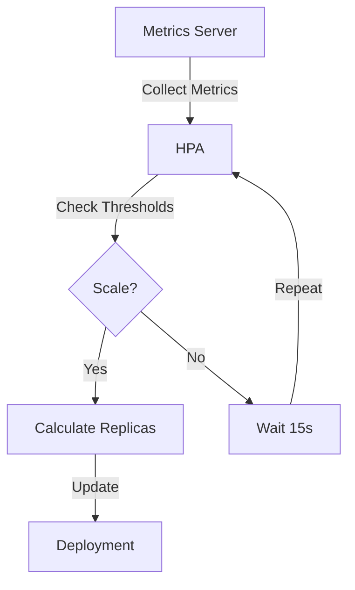

# Kubernetes Autoscaling Architecture

## System Components

### 1. Metrics Server
- Collects resource metrics from kubelets
- Exposes metrics through Metrics API
- Required for HPA functionality

### 2. Horizontal Pod Autoscaler
- Monitors specified metrics
- Calculates desired replica count
- Adjusts deployment scale

### 3. NGINX Deployment
- Runs containerized web server
- Configured with resource constraints
- Scales based on HPA decisions

## Workflow
1. Metrics Server collects utilization data
2. HPA queries metrics every 15 seconds
3. HPA calculates desired replica count
4. Deployment scales pods up/down
5. Process repeats continuously

## Resource Calculations
- CPU: Target 65% of requested (50m)
  ```
  Target CPU per pod = 50m * 0.65 = 32.5m
  ```
- Memory: Target 1Gi absolute
  ```
  Scale if: avg_memory_usage > 1Gi
  ```

## Scaling Logic
