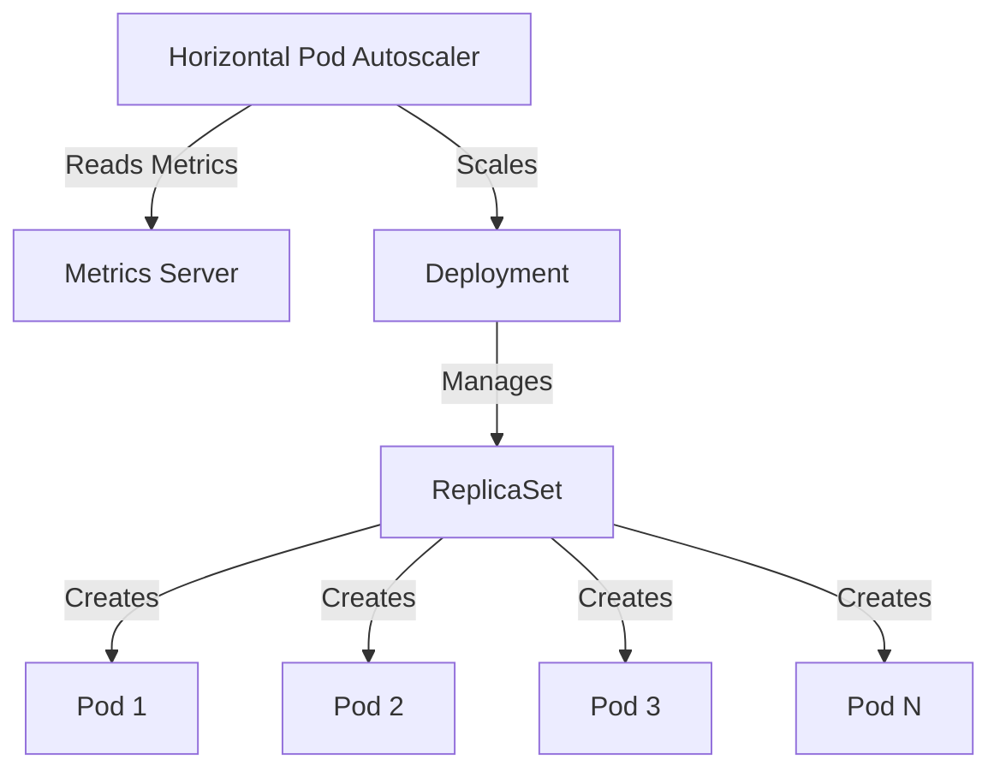

# 🚀 Kubernetes Dynamic Autoscaling Master

[](https://github.com/TheToriqul/k8s-autoscaling)


## 📋 Project Overview

This project demonstrates my expertise in implementing dynamic autoscaling solutions in Kubernetes using the Horizontal Pod Autoscaler (HPA). Through hands-on implementation, I've created a robust system that automatically adjusts application resources based on demand, showcasing modern cloud-native architecture principles and DevOps best practices.

## 🎯 Key Objectives

- Implement production-grade autoscaling using Kubernetes HPA
- Master resource management with precise CPU and memory configurations
- Deploy scalable NGINX workloads with optimal performance
- Configure advanced metrics-based scaling policies
- Demonstrate deep understanding of Kubernetes orchestration

## 🏗️ Project Architecture

The project implements a sophisticated autoscaling architecture that dynamically manages application resources:



## 💻 Technical Stack

- **Container Orchestration:** Kubernetes 1.28+
- **Web Server:** NGINX (Latest)
- **Resource Management:** Kubernetes HPA
- **Metrics:** Kubernetes Metrics Server
- **Infrastructure:** Compatible with any Kubernetes cluster (local or cloud)

## 🚀 Getting Started

<details>
<summary>🐳 Prerequisites</summary>

- Kubernetes cluster (1.28+)
- kubectl CLI tool
- Metrics Server installed
- Basic understanding of Kubernetes concepts

</details>

<details>
<summary>⚙️ Installation & Setup</summary>

1. Clone the repository:
   ```bash
   git clone https://github.com/TheToriqul/k8s-autoscaling.git
   cd k8s-autoscaling
   ```

2. Deploy the NGINX application:
   ```bash
   kubectl apply -f nginx-deployment.yaml
   ```

3. Configure autoscaling:
   ```bash
   kubectl apply -f nginx-hpa.yaml
   ```

</details>

## 💡 Key Learnings

### Technical Mastery:

1. Advanced Kubernetes autoscaling mechanisms and architecture
2. Resource optimization techniques for containerized applications
3. Metric-based scaling strategies and implementation
4. Production-grade deployment configurations
5. Performance monitoring and optimization in Kubernetes

### Professional Development:

1. Cloud-native architecture design principles
2. DevOps best practices for scalable applications
3. System reliability engineering concepts
4. Performance optimization strategies
5. Infrastructure automation techniques

## 🔄 Future Enhancements

<details>
<summary>View Planned Improvements</summary>

1. Custom metrics implementation for more granular scaling
2. Integration with cloud provider-specific autoscaling features
3. Advanced monitoring and alerting setup
4. Performance benchmarking tools
5. Automated testing framework for scaling behaviors
6. Cost optimization analysis tools

</details>

## 🙌 Contribution

Contributions are welcome! Feel free to [open an issue](https://github.com/TheToriqul/k8s-autoscaling/issues) or submit a [pull request](https://github.com/TheToriqul/k8s-autoscaling/pulls).

## 📧 Connect with Me

- 📧 Email: toriqul.int@gmail.com
- 📱 Phone: +65 8936 7705, +8801765 939006
- 🌐 LinkedIn: [@TheToriqul](https://www.linkedin.com/in/thetoriqul/)
- 🐙 GitHub: [@TheToriqul](https://github.com/TheToriqul)
- 🌍 Portfolio: [TheToriqul.com](https://thetoriqul.com)

## 👏 Acknowledgments

- [Poridhi](https://devops.poridhi.io/) for providing comprehensive learning resources
- The Kubernetes community for excellent documentation
- NGINX team for maintaining a reliable web server image

---

Thank you for exploring my Kubernetes autoscaling project. This implementation demonstrates my capabilities in cloud-native technologies and DevOps practices. Happy scaling! 🚀